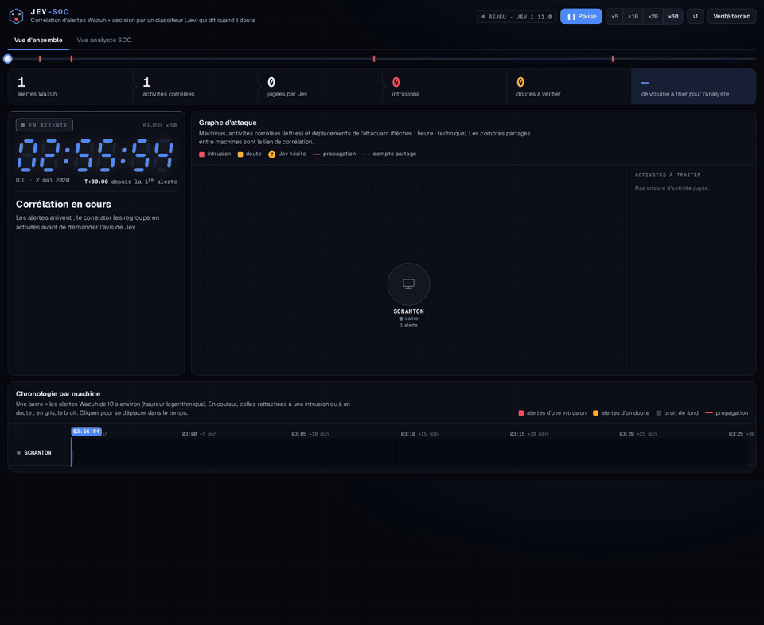
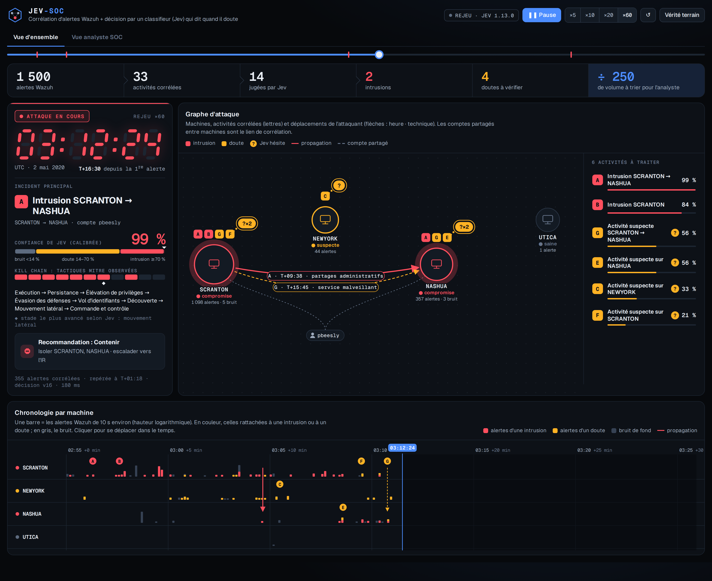
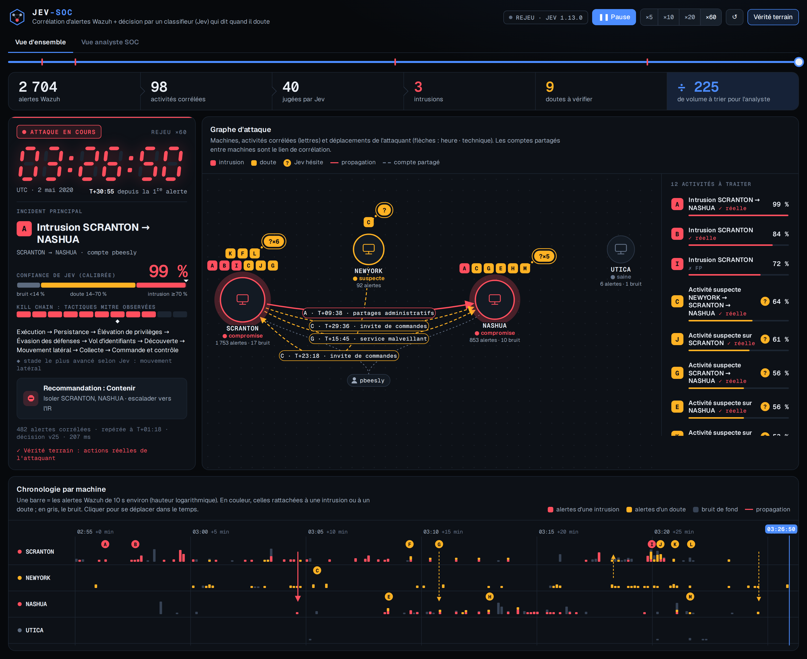

# Jev-SOC

**Correlated triage of Wazuh alerts to catch multi-stage attacks.** Alerts are grouped into
clusters (shared machines, accounts, Sysmon process trees, files), each cluster is judged by a
"System One" decision model (Jev through the TypeSafe API, or Laya locally), and a structured,
versioned decision is stored for the analyst. The full project brief (in French) is in
[`CLAUDE.md`](CLAUDE.md).

**Shadow mode by design:** the system never blocks anything and never modifies an alert. It only
writes decisions next to the existing workflow.



▶ [Full demo video (37 s, MP4)](docs/demo.mp4) · [HD screenshot](docs/demo_hd.png) ·
[End of replay with ground truth](docs/demo_end_ground_truth.png)

> Note: the UI and code comments are in French (student project, CESI Nancy); identifiers and
> this README are in English.

## At a glance

On MITRE's APT29 emulation (ATT&CK Evaluations, day 1), with the Windows/Sysmon logs replayed
into a real Wazuh 4.14 manager:

- **2,704 Wazuh alerts → 12 items to review** (3 intrusions, 9 "doubts").
- The main chain is flagged **1 min 18 s** after the first alert, then confirmed at 99 %.
- Lateral movement SCRANTON → NASHUA is rebuilt by the correlator (two activities merge into one).
- Ground truth: 2 of 3 intrusions are real (1 false positive at 72 %), 6 of 9 doubts are real,
  and none of the 28 activities classified as background noise contains attacker actions.
- Full APT29 evaluation: **F1 0.75 vs 0.25** for the `max_level >= 7` rule, **ECE 0.30 → 0.08**
  after calibration learned on a different dataset (Linux), never tuned on APT29.

## Status

| Milestone | Status |
|---|---|
| 1. Skeleton, `MockBackend`, `eval.py` harness | done (+ `JevBackend`) |
| 2. Labeled cluster dataset | done on **real Wazuh alerts**: AIT-ADS (Linux/web) + MITRE's APT29 emulation (Windows/Sysmon) replayed into a real Wazuh |
| 3. Serializer + correlator | done: offline (evaluation) and incremental (streaming, versioned decisions); Linux and Windows/Sysmon entities |
| Live demo | done: replay of real Wazuh alerts, recorded or live mode (`demo/`) |
| Decision policy + calibration | done, tuned on the AIT validation split only |
| 4. `LayaBackend` zero-shot | to do |
| 5 to 9 | to do |

## Installation

```bash
python -m venv .venv && source .venv/bin/activate
pip install -e ".[dev]"        # core + pytest + ruff
pip install -e ".[dev,jev]"    # + TypeSafe SDK for the Jev backend
```

For the Jev backend, the key goes in the environment, never in the repository:

```bash
export TYPESAFE_API_KEY=...    # or in a .env file (ignored by git)
```

## Usage

```bash
# Regenerate the ablation matrix (3 scenarios x 4 variants) in data/ablation/
python scripts/make_variants.py

# Build labeled clusters from real Wazuh alerts (see data/README.md)
python scripts/build_ait_dataset.py

# Windows attacks: replay Windows/Sysmon logs into a real Wazuh (see data/README.md)
sudo python scripts/wazuh_replay.py data/raw/apt29/<day>.json data/raw/apt29/alerts/<day>_wazuh.ndjson
python scripts/build_apt29_dataset.py

# Calibration + thresholds, fitted on VALIDATION from recorded decisions (no API call)
python eval/calibrate.py --results eval/results/jev-ait.json

# Replay an evaluation without calling the API again
python eval/eval.py --data data/ait --split test --replay eval/results/jev-ait.json

# Suspicion curve: decision re-taken at each new alert of a scenario
python scripts/prefix_curve.py --backend jev

# Evaluate a backend on the labeled clusters
python eval/eval.py                    # backend from config/config.yaml (mock by default)
python eval/eval.py --backend jev      # TypeSafe API: cluster states leave your perimeter!
python eval/eval.py --backend jev --data data/ait --out eval/results/jev-ait.json
```

Backend choice, thresholds and correlation parameters live in
[`config/config.yaml`](config/config.yaml). The typed questions are in
`config/questions.v2.json`; the version (`v2`) is stored in every decision.

## Live demo

Replays **real Wazuh alerts** (APT29 emulation, day 1: 2,704 alerts over 31 min) through the
incremental correlator; the model re-judges an activity whenever its summary changes.



Dark SOC console (single theme, on purpose). Two tabs:

- **Overview**:
  - funnel: alerts → correlated activities → judged by Jev → intrusions / doubts;
  - incident panel: **7-segment clock** (real UTC time of the replay), tracked activity,
    confidence gauge showing both thresholds, **kill chain** of observed MITRE tactics (Jev's
    estimated stage shown separately) and recommended action;
  - **attack graph**: machines, activity letters, propagation arrows labeled "time · technique",
    shared accounts that linked the alerts, and a "?" bubble wherever Jev hesitates;
  - **per-machine timeline**: alerts colored by the activity they joined, detections,
    propagation, clickable playhead;
  - key moments, method, and a ground-truth check.
- **SOC analyst view**: per-activity P(attack) curves with thresholds, detailed cards (raw and
  calibrated probabilities, MITRE chain, deterministic justification), alert feed and log of
  versioned decisions.

Activity names ("Intrusion SCRANTON → NASHUA") and tactics are computed by fixed rules in
`src/jevsoc/naming.py` (machines in order, MITRE techniques from Wazuh rules, recommended
action): no generated text. "Jev hesitates" means the calibrated P sits between the
investigation threshold and the containment threshold.

```bash
# Safest option for a presentation: standalone page, no network, no server (double-click)
open demo/apt29_day1_standalone.html

# Replay the recording through the server (speed adjustable in the page)
python scripts/demo.py serve --recording demo/recordings/apt29_day1.json     # http://127.0.0.1:8000

# True live mode: the engine runs and calls Jev as alerts arrive (TYPESAFE_API_KEY required)
python scripts/demo.py serve --live --backend jev --speed 20 --truth apt29 \
    --alerts data/raw/apt29/alerts/day1_wazuh.ndjson --history data/raw/apt29/alerts/day2_wazuh.ndjson

# Re-record (81 Jev calls, ~20 s), then rebuild the standalone page
python scripts/demo.py record --backend jev --truth apt29 --alerts ... --history ... \
    --out demo/recordings/apt29_day1.json
python scripts/demo.py build --recording demo/recordings/apt29_day1.json --out demo/apt29_day1_standalone.html
```

What the recording shows: attack **A "Intrusion SCRANTON → NASHUA"** is flagged at T+01:18
(77 %) and rises to 99 % (contain). **D "Intrusion NASHUA"** (admin shares, WinRM, tool
transfer) reaches "contain" at T+15:06, then merges into A at T+15:46: the correlator has
rebuilt the lateral movement. At the end of the replay: 3 intrusions (2 real, 1 false positive
at 72 %), 9 activities where Jev hesitates (6 real, 3 noise), 28 activities judged background
noise, none with attack indicators. The "Vérité terrain" (ground truth) button shows these
verdicts.



**Reproducibility:** the Jev API is not strictly deterministic. A second full recording (same
alerts, same 81 decisions) gives **exactly the same actions**, with probabilities varying by at
most 0.04 (raw) and 0.08 (calibrated). That is why the demo replays a frozen recording.

## Tests

```bash
pytest          # 56 tests, no network call
ruff check . && ruff format --check .
```

## How to read the evaluation

- Two questions: **all attacks** vs benign, and **multi-stage chains** vs benign (what the
  `is_sophisticated_attack` question asks).
- **Calibrated Jev**: P(attack) recalibrated (Platt, 2 parameters, `config/calibration.yaml`),
  then an investigation threshold of 0.14. **Full system**: policy action ≠ `monitor`.
- **Baselines**: `max_level >= 7`, sum of levels, alert volume, computed on the cluster's real
  rule levels.
- **AUC**: threshold-free, a fair comparison for everyone. **Brier / ECE**: quality of the
  probabilities. **FP/day**: false positives projected over all real benign clusters.
- Every tuning step (calibration, thresholds) uses the **AIT validation split** (fox, harrison,
  wheeler). The numbers below are on the **test** set: the 5 other AIT scenarios, and all of
  APT29.

## Measured results (Jev `jev-1.13.0`, test set only)

### Linux / web: AIT-ADS, 5 test scenarios (174 clusters, 24 attacks including 5 chains)

| Method | Multi-stage chains: recall | All attacks: F1 | AUC | False positives / day |
|---|---|---|---|---|
| Calibrated Jev (P ≥ 0.14) | **5 / 5** | 0.50 | 0.78 | **0** |
| Full system (Jev + volume) | 5 / 5 | **0.76** | **0.88** | 3 |
| `volume >= 65` | 2 / 5 | 0.67 | 0.73 | 3 |
| `max_level >= 7` | 3 / 5 | 0.33 | 0.50 | 70 |

Jev catches every chain (including quiet level-4 privilege escalations) with no false alert, but
does not flag standalone scans; the volume rule covers those.

### Windows: MITRE's APT29 emulation replayed into Wazuh (55 clusters, 9 attacks including 5 chains)

This dataset was **never used to tune anything**: different OS, attacker and tooling.

| Method | Multi-stage chains: recall | All attacks: precision / recall / F1 | AUC |
|---|---|---|---|
| Calibrated Jev (P ≥ 0.14) | **5 / 5** | 0.60 / 1.00 / **0.75** | **0.97** |
| Full system (Jev + volume) | 5 / 5 | 0.36 / 1.00 / 0.53 | 0.83 |
| `max_level >= 7` | 4 / 5 | 0.15 / 0.78 / 0.25 | 0.66 |
| `volume >= 65` | 2 / 5 | 0.23 / 0.33 / 0.27 | 0.58 |

- **The calibration learned on Linux holds on Windows**: ECE 0.30 raw → 0.08 calibrated.
- **Correlation groups the attack well**: 367 of the 372 attacker alerts of day 1 and all 98 of
  day 2 end up in judged clusters (day 2: the whole attack in a single cluster). Hence few attack
  clusters: 9, still a small sample.
- **The volume rule does not transfer**: on Windows, bursts come from noisy Wazuh rules
  ("Explorer accessed by RuntimeBroker", hundreds per minute), not from scans. It costs the full
  system precision.
- Jev's false positives on Windows (6 of 46 benign): mostly `lsass` / `svchost` accesses to
  Explorer and PowerShell scripts; nothing was tuned to avoid them.

### Recalibration (AIT validation, 3 chains + 116 non-chains)

`P_calibrated = sigmoid(2.21 × logit(P_raw) − 1.87)`. A raw P of 0.5 actually means ~13 % odds
of a multi-stage chain; 0.8 means ~77 %. ECE on the AIT test set: 0.19 → 0.01. The investigation
threshold (0.14) sits in the middle of the validation gap between the most suspicious benign
cluster (0.02) and the least suspicious chain (0.26).

### What was fixed along the way (transparency)

- **Priority rule disabled** (`priority_monitor_max` 3.0 → 4.0) **after** seeing the APT29 test:
  the model's priority is not calibrated (Windows benign at 3.2–3.7) and sent 50 of 57 benign
  clusters to `investigate`. On the AIT validation split it added no chain.
- **APT29 labels corrected after reviewing disagreements** with Jev: a hidden PowerShell launched
  through WMI (an attack missed by the indicator list) and Azure agent commands (wrongly labeled
  as attack). The corrected rules are general, but only reviewing disagreements favors the model:
  these APT29 numbers are therefore slightly optimistic.
- **Windows correlation fixed** while building the demo: the TARGET process of an access
  (Sysmon 10, e.g. `explorer.exe`) no longer links alerts (it merged the attacker with Windows
  noise), and hubs are learned on the other day (history). The APT29 numbers above are post-fix.
- Limits: few chains (5 + 5), labels from indicators or time windows, one attack family per
  environment, probabilities calibrated at the sample's prevalence (much higher than in a real SOC).

### Hand-made scenarios (ablation, 12 clusters)

Jev separates the attack, the benign SCCM twin and the disguised attack (AUC 1.0), while
`max_level >= 7` separates nothing (all three share the same max level). Without context hints
(`blind` variant), SCCM patching becomes a false positive (P = 0.73).

### Engineering lessons from real data

- **A noisy attacker looks like a hub.** Filtering entities by alert frequency cut the
  attacker's chain. Criterion kept: continuous presence over time.
- **A reverse proxy hides the attacker's IP.** The Wazuh rule also acts as a linking entity to
  group a burst of identical alerts.
- **The serializer can hide what matters.** Keeping the 30 most severe lines hid level-3 `sudo`
  lines behind thousands of HTTP 400 errors. State version 2: bursts merged into one "×7,105"
  line, then priority to rare lines.
- **wazuh-logtest cannot process Windows events.** To get real Windows alerts without a VM,
  `scripts/wazuh_replay.py` rebuilds the Windows XML (attributes in single quotes, otherwise
  Wazuh's parser fails) and injects it into the analysis queue like an agent would. Sysmon process
  GUIDs act as entities: they link a process tree.

## Layout

```
config/        config.yaml, questions.v2.json, entity_denylist.yaml
src/jevsoc/    models.py (Decision, Derived), metrics.py, config.py, policy.py, calibration.py,
               collector.py, correlator.py, serializer.py, live.py, naming.py, backends/ (base, mock, jev)
               + pending modules: store, reports, api, backends/laya
scripts/       make_variants.py, build_ait_dataset.py, build_apt29_dataset.py, wazuh_replay.py,
               prefix_curve.py, demo.py (live demo: record / serve / build)
demo/          index.html (demo page), recordings/ (event logs), standalone page
docs/          demo screenshots and video
data/          ablation/, ait/, apt29/, splits.yaml, README.md (sources, licenses, labeling)
eval/          eval.py (harness), calibrate.py (calibration + thresholds on validation), results/ (local)
tests/         pytest tests + one recorded real Jev response (fixtures/)
dashboards/    .ndjson exports (milestone 7)
docker/        Wazuh lab (optional)
```

## Privacy

With the Jev backend, each cluster's state (hosts, users, descriptions) is sent to the TypeSafe
API, i.e. outside your perimeter. Only use lab or anonymized data. Local mode (Laya) is the
recommended option for real data.
